# **1.1 Entorno 1 --- JupyterLab + Almond Kernel + Scala 2.12.21**

**1. Instalar JupyterLab**

-Método de instalación utilizado: Instalación nativa en Windows
utilizando el gestor de paquetes de Python (pip). Se ejecutó el comando
`pip install jupyterlab` desde la consola de comandos. A continuación se muestra la descarga e instalación de los paquetes:

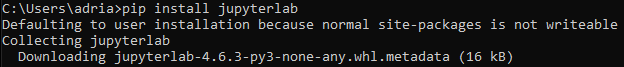

-Comando o procedimiento utilizado para iniciar JupyterLab (se usa py
porque se encuentra en ese mismo directorio). Vemos en consola cómo se inicializa el servidor local:

py -m jupyterlab

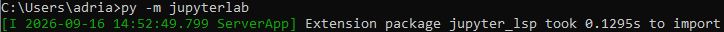

-Navegador o interfaz desde la que accedes al entorno: El acceso se
realiza a través de interfaz web utilizando el navegador Google Chrome.
Al iniciar el comando, el entorno se abre automáticamente en la
dirección local por defecto (http://localhost:8888/lab) mostrando la interfaz principal:

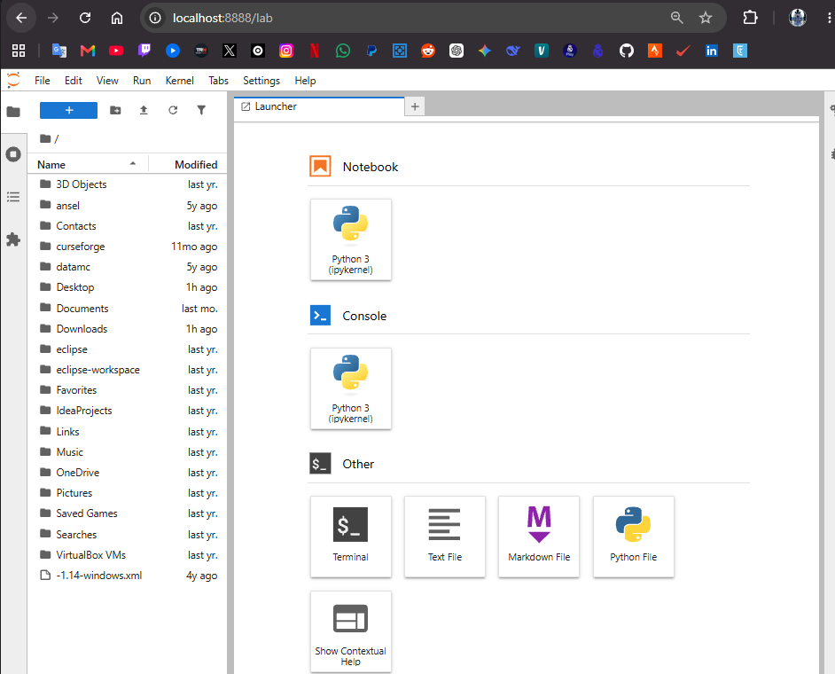

**2. Instalar Almond Kernel**

-Descargar Coursier con curl: Mediante la consola de Windows, descargamos el gestor de dependencias Coursier necesario para instalar el kernel.

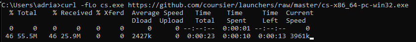

-Descarga de JAVA 17: Para evitar conflictos de dependencias, instalamos y configuramos el entorno de Java 17 de forma nativa utilizando el gestor de paquetes `winget` (distribución Temurin).

-Instalar el kernel Almond para Scala 2.12.21: Utilizamos Coursier para descargar e inicializar el kernel de Almond específico para la versión de Scala requerida en la práctica.

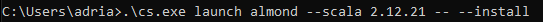

-Verificamos el acceso al kernel de Scala en Jupyter: Comprobamos en la consola que la instalación ha finalizado y el kernel de Scala se ha registrado correctamente en la lista de entornos de Jupyter.

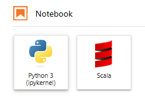

**3. Verificar la versión de Scala**

Creamos un nuevo cuaderno y ejecutamos la instrucción `scala.util.Properties.versionNumberString` para confirmar que el kernel está ejecutando efectivamente la versión 2.12.21.

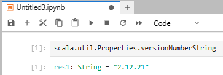

**4. Ejecutar código Scala**

¡Probamos código! En diferentes celdas del Notebook declaramos variables con interpolación de cadenas, realizamos operaciones matemáticas básicas y creamos una colección de tipo `List`, verificando que el entorno procesa y devuelve los resultados correctamente.

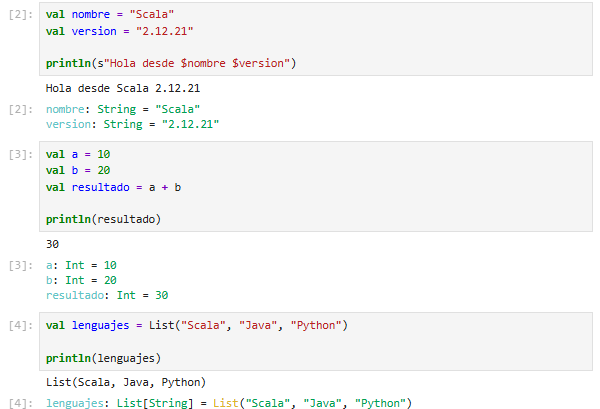

**1.2 Entorno 2 --- Visual Studio Code + Metals + Scala 2.12.21 + JDK 17 + sbt**

**1. Instalar JDK 17**

Comprobamos que el sistema reconoce correctamente el entorno de ejecución de Java 17 ejecutando el siguiente comando en la terminal:
java -version

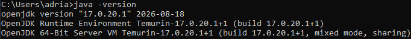

Verificamos también que el compilador de Java coincide con la versión requerida:
javac -version

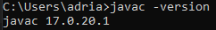

**2. Instalar Visual Studio Code**

-Versión instalada: Comprobamos la versión actual del editor Visual Studio Code desde el menú "Acerca de".

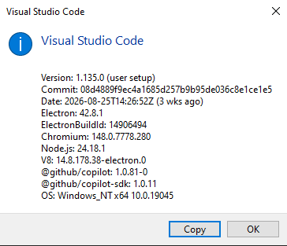

-Pantalla principal: Se muestra la interfaz inicial de VS Code arrancado correctamente desde el entorno de desarrollo portable.

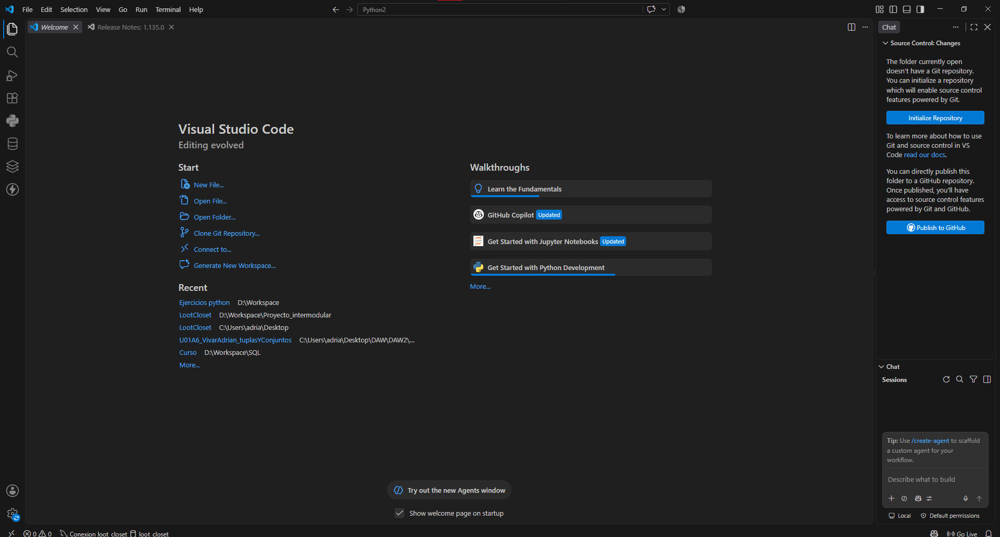

**3. Instalar extensión Metals**

Desde el apartado de extensiones de Visual Studio Code, buscamos la extensión oficial "Scala (Metals)" y procedemos a instalarla para habilitar el soporte del lenguaje en el editor.

**4. Instalar y comprobar sbt**

-Instalando: Utilizamos el gestor `winget` (`winget install Scala.sbt`) para instalar la herramienta de construcción sbt de forma automatizada y limpia.

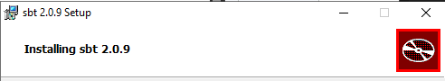

-Versión: Tras reiniciar la terminal, comprobamos que el comando responde correctamente y muestra la versión de sbt inicializando las dependencias.

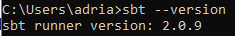

**5. Crear un proyecto Scala con sbt**

Integración con el IDE: Se abrió la carpeta raíz (scala-vscode) en el
entorno de Visual Studio Code. Desde el explorador integrado, se crearon
los archivos esenciales `build.sbt` en la raíz del proyecto y el punto de
entrada principal `Main.scala` dentro de la jerarquía de código fuente.

Captura de la estructura: Árbol de directorios creado y visualizado desde el explorador de archivos del editor.

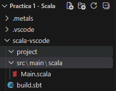

**6. Configurar Scala 2.12.21**

Archivo `build.sbt`: Editamos el archivo de configuración de sbt para indicar explícitamente que el proyecto debe utilizar la versión 2.12.21 de Scala.

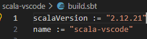

**7. Crear el programa**

Archivo `Main.scala`: Creamos el objeto principal extendiendo de `App` y añadimos las variables y funciones de impresión por consola solicitadas.

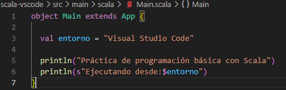

**8. Importar el proyecto con Metals**

-Comprobado con directorios de trabajo internos .bloop y .metals: Metals detecta automáticamente el archivo `build.sbt`, importa el proyecto y genera las carpetas ocultas necesarias para el servidor de compilación.

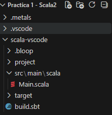

**9. Compilar el proyecto**

Ejecutamos el comando de compilación en la terminal integrada:
sbt compile

El proceso finaliza resolviendo las dependencias y devolviendo un mensaje de éxito (`[success]`) indicando que los binarios se han generado correctamente.

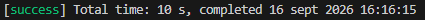

**10. Ejecutar el proyecto**

Lanzamos la aplicación mediante el comando:
sbt run

Como se aprecia en la captura, el proyecto se ejecuta compilando previamente los cambios e imprimiendo el mensaje esperado por consola.

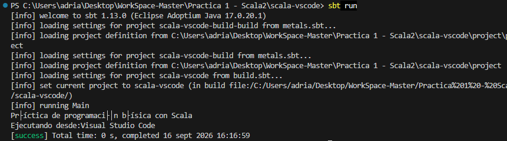

**1.3 Entorno 3 --- IntelliJ IDEA Community + Scala 2.12.21 + sbt**

**1. Instalar IntelliJ IDEA Community Edition**

Instalación: Ejecutamos el comando para instalar la versión Community oficial de JetBrains a través de la terminal.

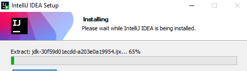

El gestor de paquetes de Windows completa la descarga y validación del entorno.

Pantalla de bienvenida de IntelliJ IDEA Community Edition recién instalado, listo para configurar proyectos nuevos.

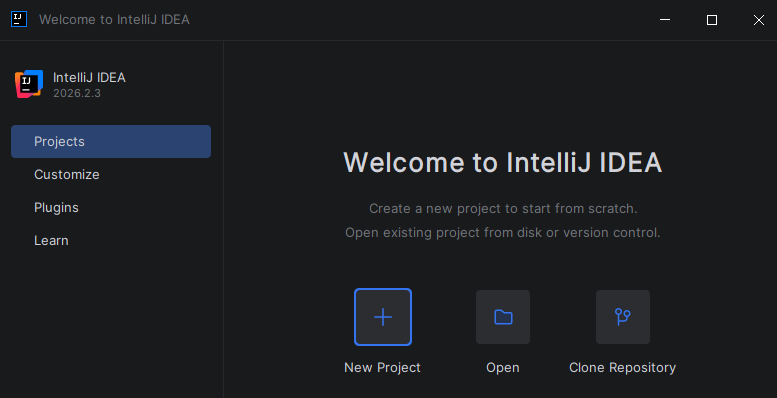

**2. Instalar el soporte para Scala**

-Instalado el plugin para Scala: Desde el apartado Plugins del IDE, buscamos la extensión oficial de Scala, la instalamos y procedemos a reiniciar el entorno para aplicar los cambios.

**3. Configurar JDK 17**

Al crear un nuevo proyecto, nos aseguramos de asignar como "Project SDK" el entorno de desarrollo JDK 17 nativo que instalamos previamente.

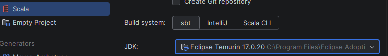

**4. Crear un proyecto sbt**

Indicamos el nombre del proyecto (`scala-intellij`), seleccionamos `sbt` como Build system y configuramos Scala en su versión 2.12.21.

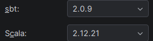

**5. Revisar build.sbt**

Comprobamos que la estructura inicializada por el IDE contiene el archivo `build.sbt` correctamente configurado con la versión de Scala correspondiente.

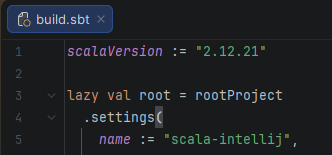

## **6. Crear un programa Scala**

Dentro de la ruta `src/main/scala/` creamos nuestro objeto `Main.scala` e incluimos el código básico de prueba utilizando interpolación de cadenas.

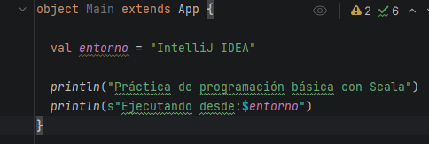

**7. Ejecutar desde IntelliJ IDEA**

Iniciamos el proceso de ejecución. En la terminal podemos ver cómo sbt toma el control para evaluar y compilar el proyecto.

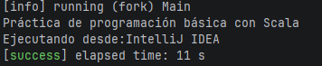

Finalmente, el programa arranca con éxito y muestra el mensaje indicando que se está ejecutando desde IntelliJ IDEA.

